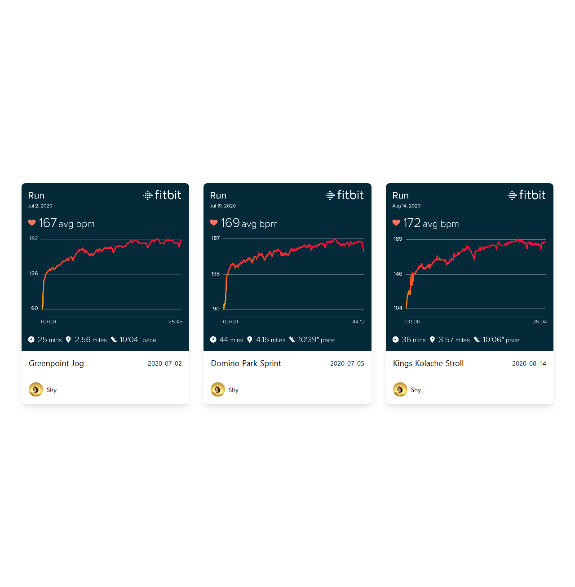

# streaming-nuxt-app



This was created using create nuxt app. Since the Contentful API is read only for this project the .env file contains functional API keys that you can use to view this project in action.

## Build Setup

```bash
# install dependencies
$ yarn install

# serve with hot reload at localhost:3000
$ yarn dev

# build for production and launch server
$ yarn build
$ yarn start

# generate static project
$ yarn generate
```

For detailed explanation on how things work, check out [Nuxt.js docs](https://nuxtjs.org).
